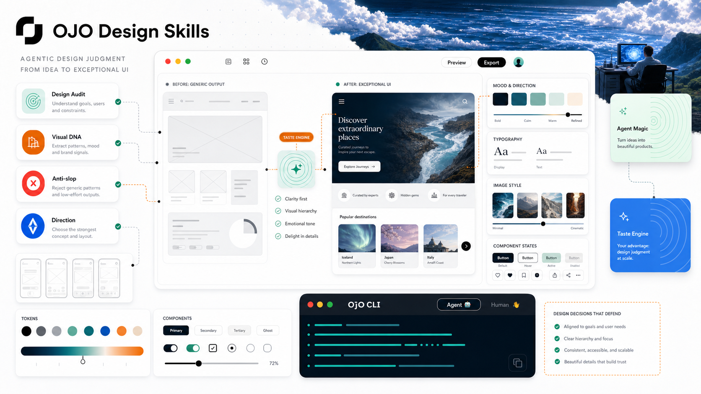
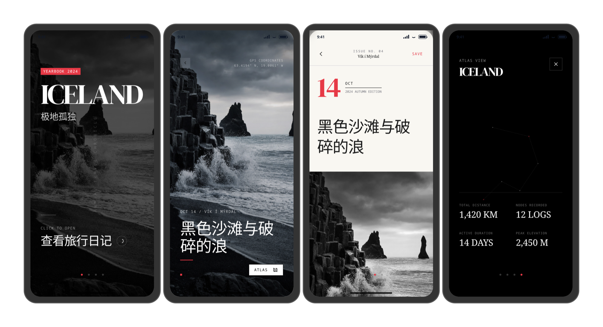
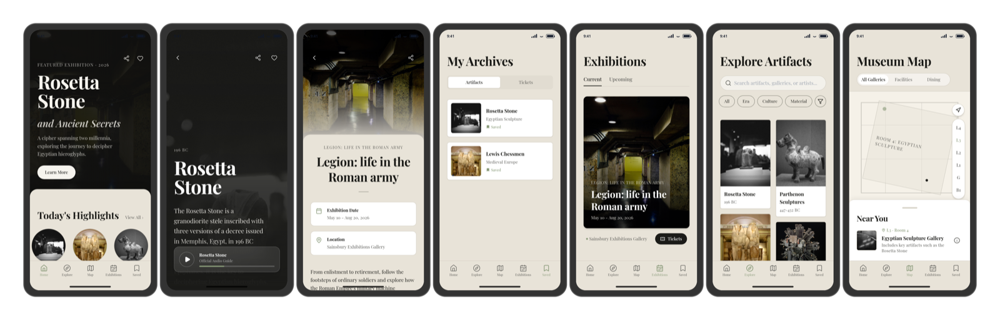
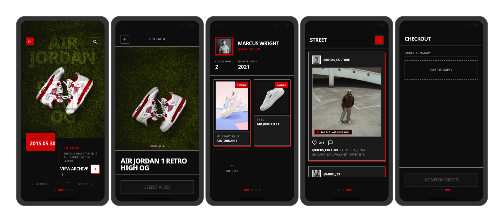
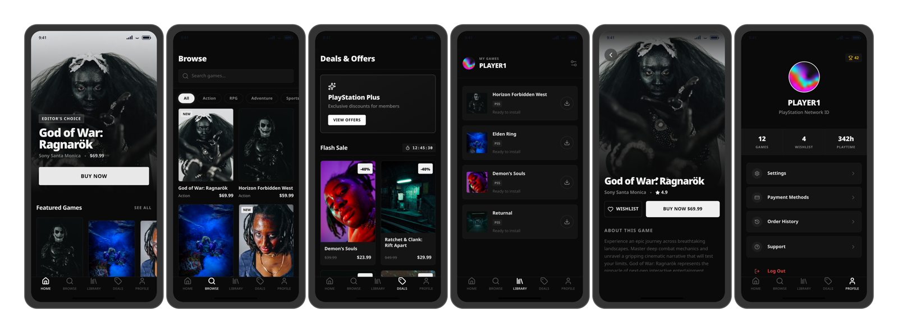

<div align="center">

# OJO Design Skills

**A portable design judgment layer for AI coding agents.**

[](./LICENSE)
[](https://github.com/touchine-ojo/OJO-Design-Skills/stargazers)
[](https://github.com/touchine-ojo/OJO-Design-Skills/commits/main)
[](#install)
[](#skills)

**English** · [简体中文](./docs/README.zh-CN.md) · [日本語](./docs/README.ja-JP.md) · [한국어](./docs/README.ko-KR.md) · [Español](./docs/README.es-ES.md)

<br>

<a href="#install"><strong>Install</strong></a>
&nbsp;&nbsp;·&nbsp;&nbsp;
<a href="#showcase"><strong>View examples</strong></a>
&nbsp;&nbsp;·&nbsp;&nbsp;
<a href="#skills"><strong>Browse skills</strong></a>
&nbsp;&nbsp;·&nbsp;&nbsp;
<a href="#how-it-works"><strong>How it works</strong></a>

<br>
<br>



</div>

---

OJO Design Skills is not a UI kit. It is a drop-in judgment layer for agents such as **Codex**, **Claude Code**, **ZCode**, **DeepCode**, **WorkBuddy**, and **OpenCode**.

It teaches an agent to read the product before styling the interface: what the user is doing, what the brand needs to feel like, which visual register is earned, and which familiar AI habits should be rejected. The goal is not prettier default UI. The goal is design output that can defend itself.

Install it once and your agent gains a portable methodology for visual direction, design tokens, component recipes, interaction states, motion rules, real imagery requirements, and strict anti-pattern guardrails.

<table>
  <tr>
    <td width="33%">
      <strong>Reads the product first</strong><br>
      Starts from audience, flow, brand evidence, and visual register before choosing colors or components.
    </td>
    <td width="33%">
      <strong>Turns taste into rules</strong><br>
      Converts direction into tokens, component recipes, state rules, motion, and layout decisions.
    </td>
    <td width="33%">
      <strong>Rejects generic output</strong><br>
      Blocks fake imagery, one-note palettes, vague premium styling, empty cards, and other AI-generated fingerprints.
    </td>
  </tr>
</table>

## Showcase

The same brief, with and without these skills installed.

<table>
  <tr>
    <th>With OJO Skills</th>
    <th>Without OJO Skills</th>
  </tr>
  <tr>
    <td align="center"></td>
    <td align="center"></td>
  </tr>
  <tr>
    <td colspan="2" align="center"><sub><b>Result:</b> a product-specific coffee experience versus a generic AI layout with placeholder imagery.</sub></td>
  </tr>
  <tr>
    <td colspan="2" align="center"></td>
  </tr>
  <tr>
    <td colspan="2" align="center"><sub><b>Range:</b> OJO can stay quiet for utility products or go loud when the brief actually calls for it.</sub></td>
  </tr>
</table>

## Design Taste Is Enforceable

OJO treats visual quality as behavior, not decoration. A direction must explain what it is doing in observable terms: density, saturation, spacing, material, motion, hierarchy, imagery, and state depth.

| Generic agent habit | OJO response |
| --- | --- |
| Starts from generic layout habits | Starts from product type, audience, brand, and user flow |
| Treats style as colors and shadows | Connects visual language to IA, density, motion, and states |
| Uses placeholders and decorative assets | Requires real, subject-specific imagery or redesigns around no image |
| Picks safe AI defaults | Blocks common AI-slop patterns before implementation |
| Outputs components without state depth | Specifies hover, active, focus, disabled, loading, selected, error, and success states |

The simplest test is brutal: if someone would immediately believe the interface was AI-generated, the design has failed.

## Design Samples

Additional output produced with these skills installed - one product, multiple surfaces.

<table>
  <tr>
    <td align="center"></td>
    <td align="center"></td>
  </tr>
  <tr>
    <td align="center"></td>
    <td align="center"></td>
  </tr>
  <tr>
    <td colspan="2" align="center"></td>
  </tr>
</table>

## Built For

OJO is useful when an agent is asked to design or implement:

| Product type | What OJO improves |
| --- | --- |
| SaaS, dashboards, internal tools | Density, hierarchy, state depth, navigation structure, and predictable component behavior |
| Consumer apps and branded products | Visual identity, emotional register, real imagery, motion, and memorable interaction moments |
| Landing pages and marketing sites | Hero quality, asset selection, section rhythm, CTA clarity, and non-generic visual systems |
| Existing UI refactors | Design critique, anti-pattern detection, token cleanup, and component-level fixes |
| Prototype-to-code workflows | Portable direction briefs that survive handoff into implementation |

## Install

Install all skills with one command. Replace `<client>` with your agent.

```bash
curl -fsSL https://raw.githubusercontent.com/touchine-ojo/OJO-Design-Skills/main/scripts/install.sh | bash -s -- --target <client>
```

| Client | `--target` | Default install directory |
| --- | --- | --- |
| Codex | `codex` | `${CODEX_HOME:-~/.codex}/skills` |
| Claude Code | `claude-code` | `${CLAUDE_HOME:-~/.claude}/skills` |
| ZCode | `zcode` | `${AGENTS_HOME:-~/.agents}/skills` |
| DeepCode | `deepcode` | `${AGENTS_HOME:-~/.agents}/skills` |
| WorkBuddy | `workbuddy` | `${WORKBUDDY_HOME:-~/.workbuddy}/skills` |
| OpenCode | `opencode` | `${OPENCODE_CONFIG_DIR:-~/.config/opencode}/skills` |
| Generic agent | `generic` | `${AGENTS_HOME:-~/.agents}/skills` |

For Codex, most users only need:

```bash
curl -fsSL https://raw.githubusercontent.com/touchine-ojo/OJO-Design-Skills/main/scripts/install.sh | bash -s -- --target codex
```

Restart or reload the client if it does not pick up the new skills.

<details>
<summary>Advanced install options</summary>

Replace existing copies without backups:

```bash
curl -fsSL https://raw.githubusercontent.com/touchine-ojo/OJO-Design-Skills/main/scripts/install.sh | bash -s -- --target codex --force
```

Install to a custom client home:

```bash
curl -fsSL https://raw.githubusercontent.com/touchine-ojo/OJO-Design-Skills/main/scripts/install.sh | CLAUDE_HOME=/path/to/.claude bash -s -- --target claude-code
```

Install to an explicit directory:

```bash
curl -fsSL https://raw.githubusercontent.com/touchine-ojo/OJO-Design-Skills/main/scripts/install.sh | bash -s -- --target opencode --dest /path/to/skills
```

Install from a local checkout:

```bash
./scripts/install.sh --target codex
```

Preview what would be written without changing files:

```bash
./scripts/install.sh --target codex --dry-run
```

Install a single skill:

```bash
./scripts/install.sh --target zcode --skill visual-direction
```

</details>

## Skills

| Skill | Use it for | What it contains |
| --- | --- | --- |
| `app-ui-ux-best-practices` | Complete UI/UX specifications, audits, design-system guidance, and production-ready component direction | Convention Track for SaaS and utility tools, Innovation Track for branded products, plus 9 reference files for anti-patterns, tokens, components, icons, motion, material metaphor, audit, and hero quality |
| `visual-direction` | Fast direction-setting, reference adaptation, critique, and downstream handoff | 2-3 differentiated directions when needed, or one decisive recommendation when the task calls for it |

### Skill Flow

```text
visual-direction
  -> choose or refine the product's visual language
  -> hand off the chosen direction

app-ui-ux-best-practices
  -> turn the direction into tokens, components, motion, layout, and quality checks
```

## How It Works

```text
Product brief
   |
   |-- Convention Track --> proven design language --> tokens --> components --> specs
   |   SaaS / utility        Notion, Linear, GitHub...
   |
   `-- Innovation Track --> insight + feeling --> methodology --> tokens --> specs
       brand-driven          material metaphor / archetype / narrative / culture
```

Both tracks require a style-direction confirmation gate before token or component work. The agent presents genuinely different directions, waits for selection, then turns the chosen direction into implementation-grade guidance.

## Guardrails

OJO treats design quality as enforceable behavior, not taste advice.

| Guardrail | Rule |
| --- | --- |
| Color | No purple-blue AI gradients by habit, no single-hue palette dressed up as a design system |
| Imagery | No gray image boxes, fake content placeholders, or decorative images when the product needs real assets |
| Navigation | No mobile tab bar unless the product has real peer destinations |
| Components | No component recipe without hover, active, focus, disabled, loading, selected, error, and success states |
| Rationale | No "premium" as a vague justification; every visual decision needs observable reasoning |

## Repository Structure

```text
skills/
  app-ui-ux-best-practices/
    SKILL.md
    references/
  visual-direction/
    SKILL.md
scripts/
  install.sh
docs/
  README.zh-CN.md
  README.ja-JP.md
  README.ko-KR.md
  README.es-ES.md
  images/
```

## Contributing

Skills are plain Markdown files under `skills/<name>/SKILL.md` plus optional `references/` files. To add or refine a skill, edit the files and run the installer locally:

```bash
./scripts/install.sh --dry-run
```

## License

[MIT](./LICENSE)
